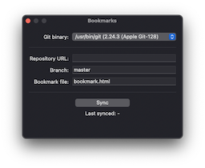
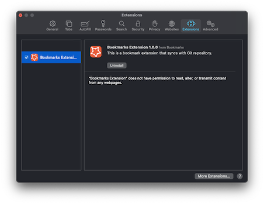

# Git Bookmarks

This is a bookmark management app for Mac that syncs with Git repositories. It consists of the app itself and a Safari Extension.

- [Getting Started](#getting-started)
- [Usage](#usage)
- [Author](#author)
- [License](#license)

## Getting Started

### Requirements

* macOS 11.0+
* Xcode 12.4+
* Swift 5.1+

## Usage

### Setup bookmark repository

Save the bookmark HTML file to any git repository. You can use a bookmark HTML file exported from Chrome or Safari.

### Sync bookmarks

Launch the app and enter the information of the git repository you want to connect to. 
This app uses your system's Git & SSH settings, so you will need to configure them beforehand from a terminal.

### Safari Extension

Launch Safari and go to Preference s> Extensions to enable Bookmark Extension.

Select the Bookmarks icon from the Safari Toolbar to see your bookmarks synced with Git.

## Author

Watanabe Toshinori – toshinori_watanabe@tiny.blue

## License

This project is licensed under the MIT License. See the [LICENSE](LICENSE) file for details.
